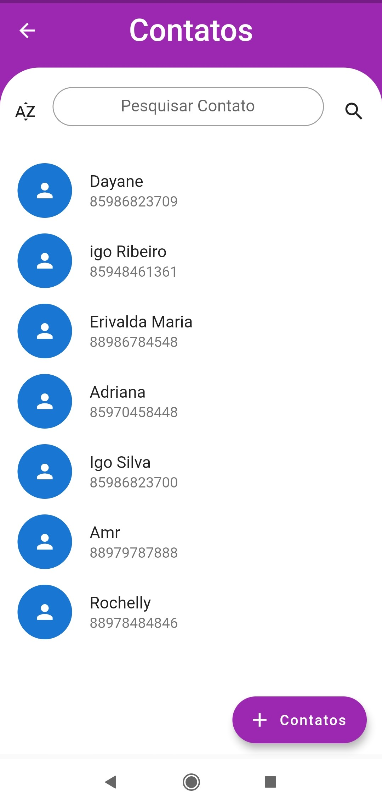
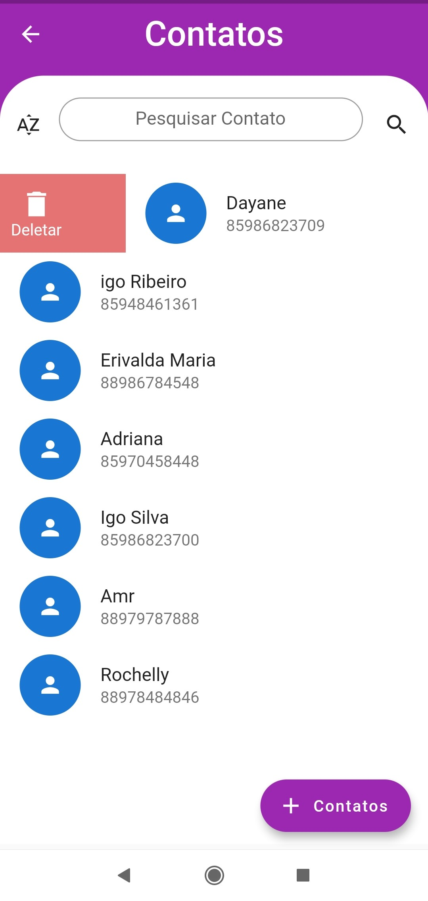

# Remind
[](https://github.com/IgoSilvari/Agenda_de_Lembretes/blob/main/LICENSE)

# Sobre o Projeto

O Remind é um App Mobile Multiplataforma para Android e IOS utilizando a Linguagem Dart e framework Flutter.

A aplicação consiste em um cadastro de contatos que pode colocar um lembrete para ligar para o mesmo, podendo ser em minutos,horas ou dias.

## Layout Mobile
  

  


# Baixar o App para Instalação.
Link: 


# Tecnologias utilizadas
- Dart
- Flutter

# Como executar o projeto

## Pré-requisito:
### Ambiente de Desenvolvimento que tenha suporte ao kit de Desenvolvimento do Flutter, como Ex: VsCode ou Android Studio
  
  ```bash
  # Clonar repositório
  git clone https://github.com/IgoSilvari/Agenda_de_Lembretes.git
  
  # Entrar na pasta do projeto
  cd Agenda_de_Lembretes
 
  # Executar o projeto
  flutter run
  ```
   
# Autor

## Igo Ribeiro da Silva
## https://www.linkedin.com/in/igo-ribeiro-23b0bb169


  
